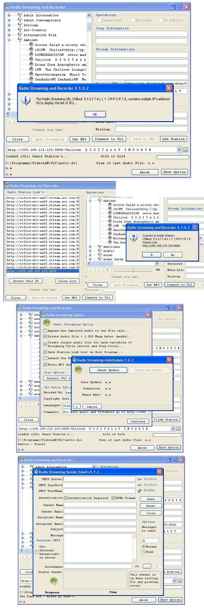



## Radio Streaming & Recorder v1\.0\.2b

### Description

An example of how use VLC libraries to play streaming radio stations and save them to MP3's!

Note:

Download the Program Setup.exe at this link: http://www.netshadows.it/RSRv102.exe

Download the complete source binary at this link: http://www.netshadows.it/RSRv102.rar

Download the necessary Plug-In at this link: http://www.netshadows.it/vlcplugins.exe

If in the project (.*zip) should not be libraries and controls necessary for the proper functioning of the project, download the full project at this link: http://www.netshadows.it/RSRv102.rar

Enjoy and happy conding VB :))
 
### More Info
 

             |
---                |---
**Submitted On**   |2011-05-21 20:21:42
**By**             |[Salvo Cortesiano \(Italy\)](https://github.com/Planet-Source-Code/PSCIndex/blob/master/ByAuthor/salvo-cortesiano-italy.md)
**Level**          |Advanced
**User Rating**    |4.0 (16 globes from 4 users)
**Compatibility**  |VB 6\.0
**Category**       |[Internet/ HTML](https://github.com/Planet-Source-Code/PSCIndex/blob/master/ByCategory/internet-html__1-34.md)
**World**          |[Visual Basic](https://github.com/Planet-Source-Code/PSCIndex/blob/master/ByWorld/visual-basic.md)
**Archive File**   |[Radio\_Stre2204795232011\.zip](https://github.com/Planet-Source-Code/salvo-cortesiano-italy-radio-streaming-recorder-v1-0-2b__1-73924/archive/master.zip)

